# Documento de Diseño: ExplorerFrame

## Visión General

ExplorerFrame es una herramienta de administración remota personal para equipos Windows. Consta de tres componentes: un **Agent** (`explorer.py`) que corre en el equipo administrado y expone control total vía bot de Telegram, un **Server** (`app.py`) desplegado en la nube que gestiona autenticación 2FA, usuarios y distribución del ejecutable, y un script auxiliar **Winverm** (`winverm.py`) que garantiza la presencia y actualización del ejecutable en el equipo destino.

La comunicación entre el Agent y el operador ocurre exclusivamente a través de la API de Telegram. El Server actúa como punto de distribución y autenticación, nunca como intermediario de comandos en tiempo real.


---

## Arquitectura del Sistema

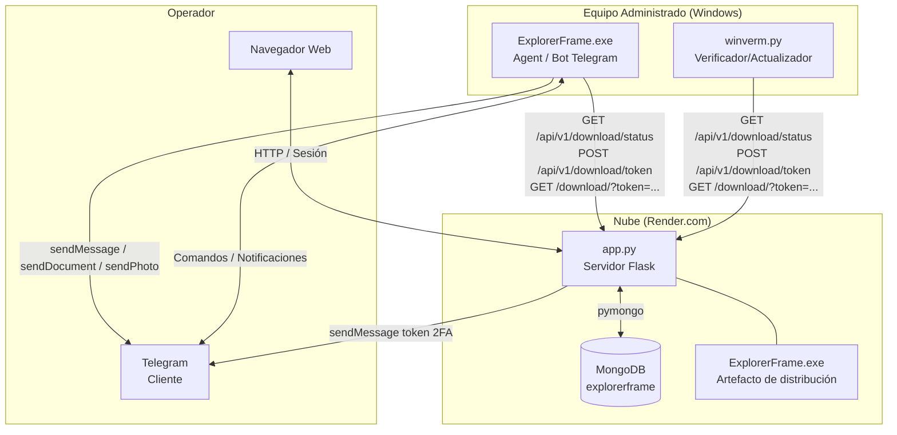

---

## Diseño del Agent (`explorer.py`)

### Ciclo de vida

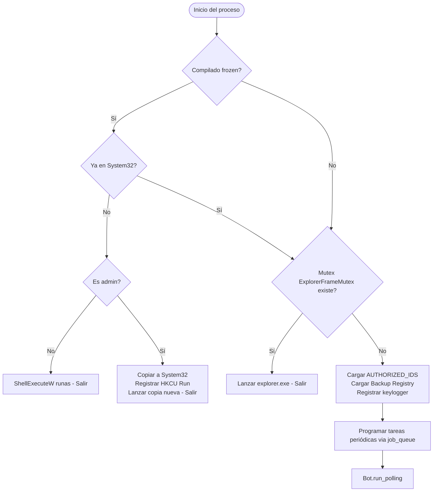

### Tareas periódicas (job_queue)

| Tarea | Intervalo | Primera ejecución |
|---|---|---|
| `auto_backup` | 600 s | 10 s |
| `check_screen_changes` | 5 s | 5 s |
| `send_keylog` | 600 s | 600 s |
| `check_for_updates` | 1800 s | 30 s |

### Flujo de autorización

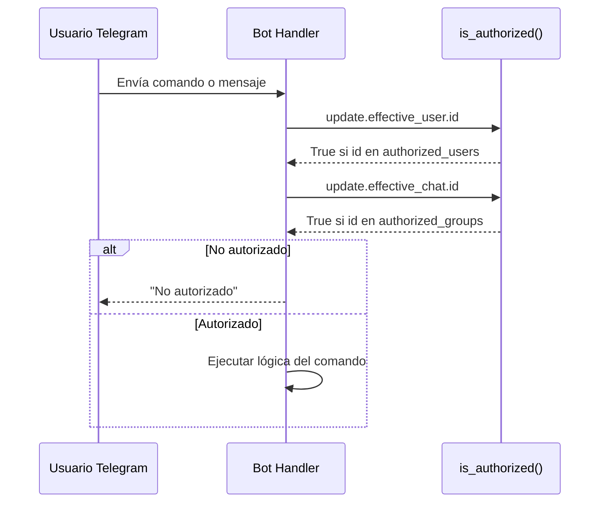

### Módulo de respaldo incremental

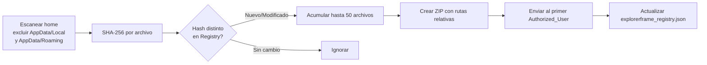

### Módulo de captura de pantalla

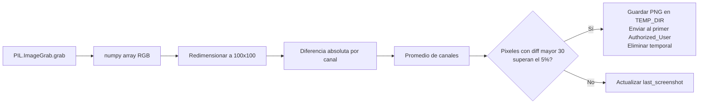

### Módulo de actualización automática

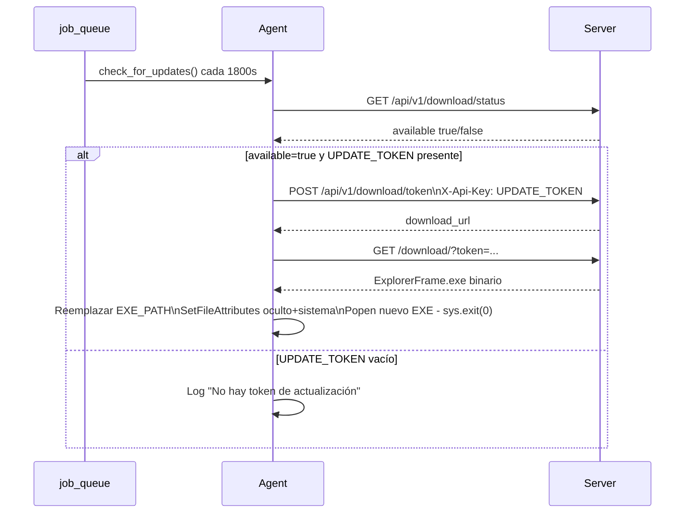


---

## Diseño del Server (`app.py`)

### Componentes internos

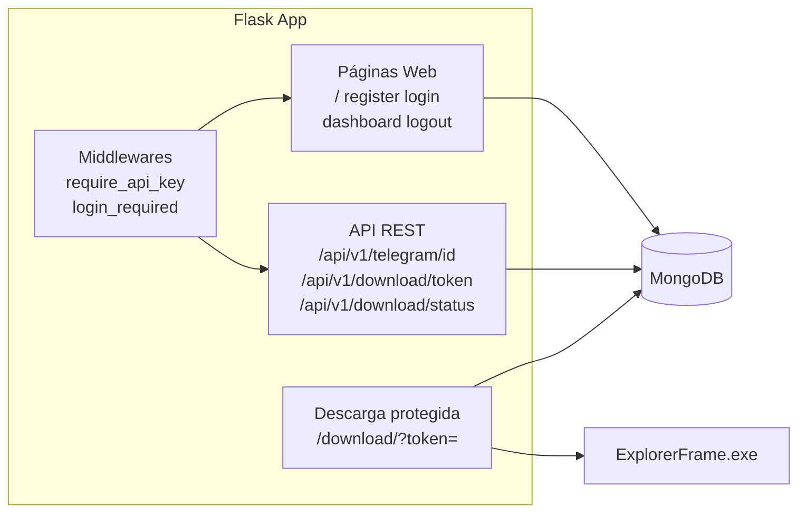

### Flujo de registro (2FA)

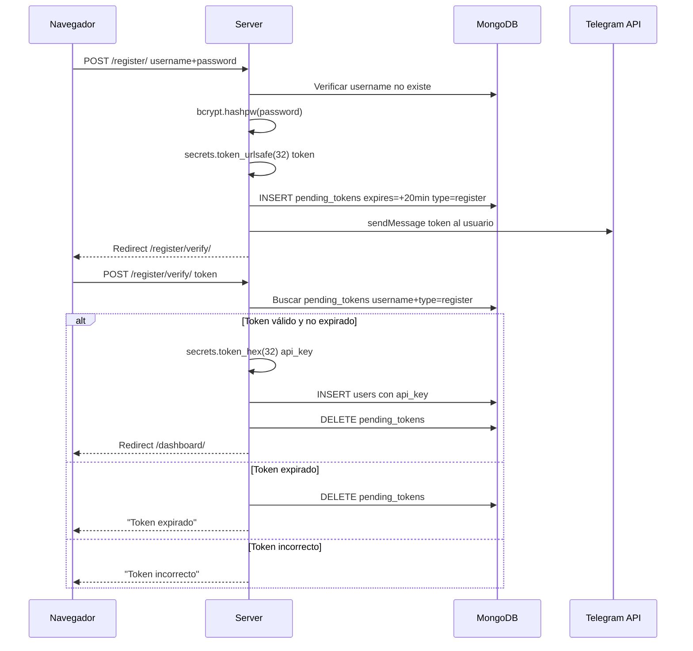


### Flujo de descarga protegida

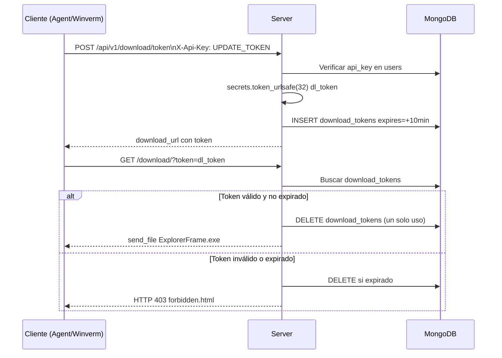

### Endpoints del Server

| Método | Ruta | Auth | Descripción |
|---|---|---|---|
| GET | `/` | — | Página de inicio |
| GET/POST | `/register/` | — | Formulario de registro |
| GET/POST | `/register/verify/` | Sesión pending | Verificación token 2FA |
| GET/POST | `/login/` | — | Formulario de login |
| GET/POST | `/login/verify/` | Sesión pending | Verificación token 2FA |
| GET | `/dashboard/` | Sesión activa | Panel del usuario |
| GET | `/logout/` | — | Cierra sesión |
| GET | `/download/` | Download_Token (query) | Descarga del ejecutable |
| GET | `/api/v1/telegram/id` | API_Key | Lista de usernames registrados |
| POST | `/api/v1/download/token` | API_Key | Genera Download_Token |
| GET | `/api/v1/download/status` | API_Key | Estado del ejecutable |

---

## Diseño de Winverm (`winverm.py`)

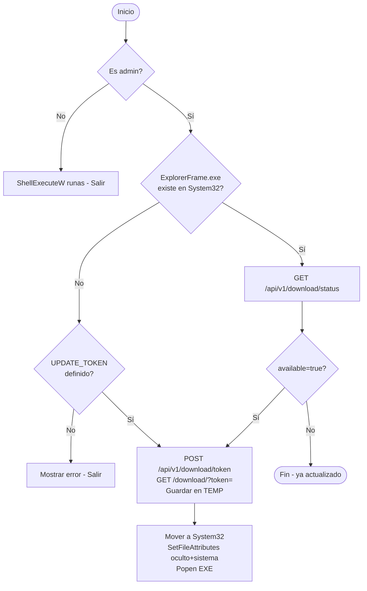

---

## Modelos de Datos

### MongoDB — Colección `users`

```python
{
    "_id": ObjectId,
    "telegram_username": str,   # username o ID numérico de Telegram
    "password_hash": str,       # bcrypt hash
    "api_key": str,             # 64 chars hex (secrets.token_hex(32))
    "created_at": datetime      # UTC sin tzinfo
}
```

Índice único implícito: `telegram_username`.

### MongoDB — Colección `pending_tokens`

```python
{
    "_id": ObjectId,
    "telegram_username": str,
    "token": str,               # secrets.token_urlsafe(32)
    "password_hash": str,       # solo en type=register
    "expires": datetime,        # UTC, +20 minutos desde creación
    "type": str                 # "register" | "login"
}
```

Se elimina al consumirse o al expirar. Un solo registro activo por usuario+tipo.

### MongoDB — Colección `download_tokens`

```python
{
    "_id": ObjectId,
    "token": str,               # secrets.token_urlsafe(32)
    "issued_to": str,           # telegram_username del solicitante
    "expires": datetime,        # UTC, configurable hasta 60 min
    "created_at": datetime
}
```

Se elimina inmediatamente tras la primera descarga exitosa (un solo uso).

### Archivo local — `explorerframe_registry.json`

Ruta: `%APPDATA%\explorerframe_registry.json`

```json
{
    "C:\\Users\\user\\Documents\\file.txt": "sha256hex...",
    "C:\\Users\\user\\Desktop\\notes.txt": "sha256hex..."
}
```

Clave: ruta absoluta del archivo. Valor: hash SHA-256 en el momento del último respaldo exitoso.

### Archivos temporales del Agent

| Archivo/Directorio | Ruta | Propósito |
|---|---|---|
| `keylog.txt` | `%APPDATA%\keylog.txt` | Registro de pulsaciones de teclado |
| `explorerframe_temp\` | `%APPDATA%\explorerframe_temp\` | Capturas PNG y ZIPs temporales |
| `explorerframe_registry.json` | `%APPDATA%\explorerframe_registry.json` | Backup_Registry persistente |

---

## Flujos de Datos Principales

### Flujo 1: Comando de control de energía

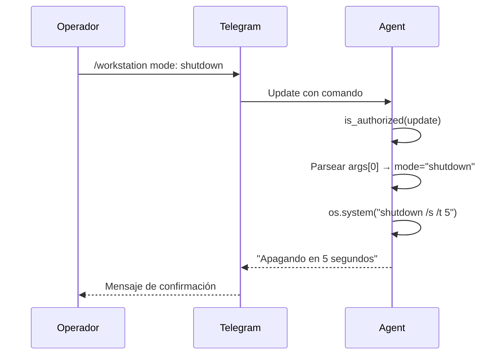

### Flujo 2: Explorador de archivos interactivo

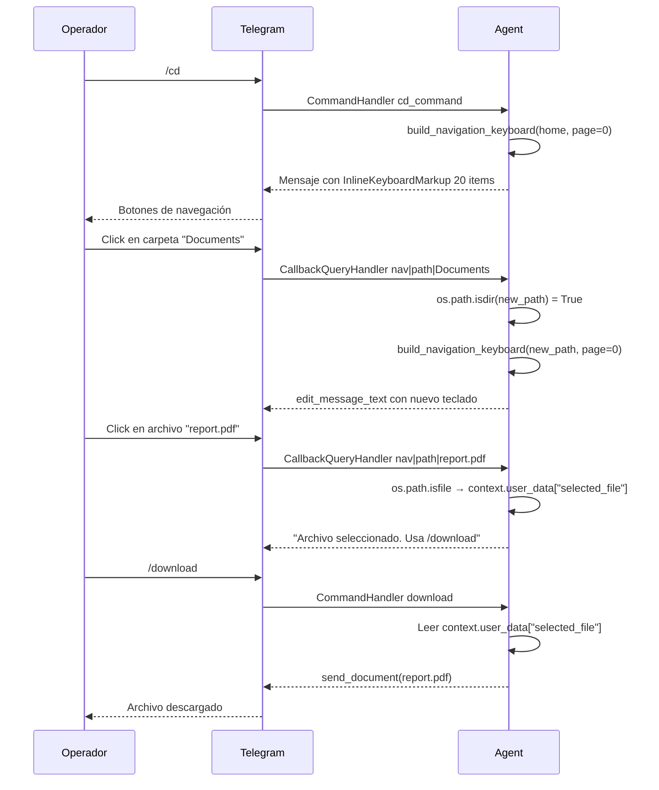

### Flujo 3: Aplicación de parche vía Telegram

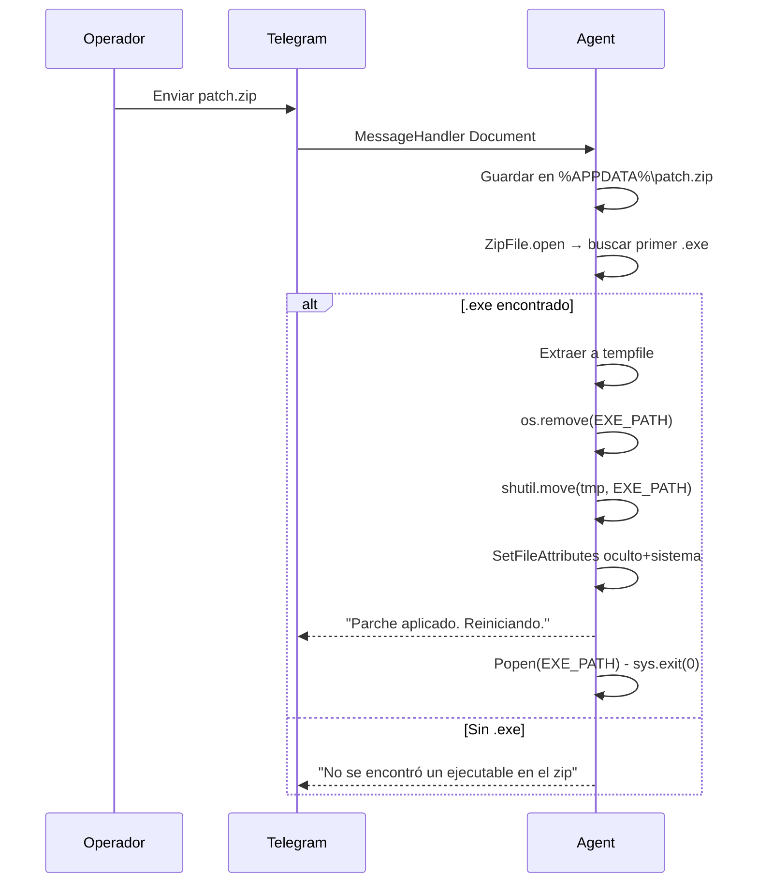

---

## Propiedades de Corrección

Las siguientes propiedades son candidatas a property-based testing con `hypothesis` (Python).

### P1 — Autorización: ningún ID no autorizado pasa el filtro

```python
# Propiedad: para cualquier ID entero que no esté en authorized_users
# ni en authorized_groups, is_authorized() debe retornar False.
@given(st.integers())
def test_unauthorized_id_rejected(random_id):
    authorized_users = {1001, 1002}
    authorized_groups = {-100123}
    assume(random_id not in authorized_users)
    assume(random_id not in authorized_groups)
    assert not is_authorized_by_id(random_id, authorized_users, authorized_groups)
```

### P2 — Parsing de AUTHORIZED_IDS: idempotencia y separación correcta

```python
# Propiedad: parsear una lista de IDs y grupos produce exactamente
# los conjuntos esperados sin elementos extra ni faltantes.
@given(st.lists(st.integers(min_value=1), min_size=0, max_size=20),
       st.lists(st.integers(min_value=1), min_size=0, max_size=5))
def test_authorized_ids_parsing(user_ids, group_ids):
    ids_str = ",".join(
        [str(u) for u in user_ids] +
        [f"grupo:{g}" for g in group_ids]
    )
    users, groups = parse_authorized_ids(ids_str)
    assert users == set(user_ids)
    assert groups == set(group_ids)
```

### P3 — Backup Registry: solo archivos modificados se incluyen

```python
# Propiedad: si el hash de un archivo coincide con el registry,
# is_new_file() retorna False. Si difiere, retorna True.
@given(st.binary(min_size=1, max_size=1024))
def test_registry_detects_changes(content):
    h = hashlib.sha256(content).hexdigest()
    registry = {"file.txt": h}
    assert not is_new_file_with_registry("file.txt", h, registry)
    different_hash = hashlib.sha256(content + b"x").hexdigest()
    assert is_new_file_with_registry("file.txt", different_hash, registry)
```

### P4 — Token de descarga: un solo uso

```python
# Propiedad: después de consumir un Download_Token, cualquier
# intento adicional de usarlo debe retornar 403.
@given(st.text(min_size=10, max_size=50))
def test_download_token_single_use(token_value):
    store = {token_value: {"expires": future_datetime()}}
    # Primera descarga: éxito
    result1 = consume_token(token_value, store)
    assert result1 == "ok"
    # Segunda descarga: token ya no existe
    result2 = consume_token(token_value, store)
    assert result2 == "forbidden"
```

### P5 — Expiración de tokens: tokens vencidos son rechazados

```python
# Propiedad: cualquier token cuya fecha de expiración sea anterior
# a utcnow() debe ser rechazado independientemente de su valor.
@given(st.timedeltas(max_value=timedelta(seconds=-1)))
def test_expired_token_rejected(delta):
    expired_at = datetime.utcnow() + delta  # siempre en el pasado
    token = {"token": "abc", "expires": expired_at}
    assert not is_token_valid(token)
```

### P6 — Detección de cambios en pantalla: umbral consistente

```python
# Propiedad: dos imágenes idénticas nunca superan el umbral de diferencia.
@given(st.integers(min_value=1, max_value=200),
       st.integers(min_value=1, max_value=200))
def test_identical_images_not_different(w, h):
    img = np.zeros((h, w, 3), dtype=np.uint8)
    assert not images_different(img, img.copy(), threshold=0.05)
```

### P7 — Hashing SHA-256: determinismo

```python
# Propiedad: el mismo contenido de archivo siempre produce el mismo hash.
@given(st.binary(min_size=0, max_size=65536))
def test_sha256_deterministic(content):
    h1 = hashlib.sha256(content).hexdigest()
    h2 = hashlib.sha256(content).hexdigest()
    assert h1 == h2
```

### P8 — API Key: formato correcto al generarse

```python
# Propiedad: toda API Key generada tiene exactamente 64 caracteres hexadecimales.
@given(st.integers(min_value=1, max_value=100))
def test_api_key_format(n):
    for _ in range(n):
        key = secrets.token_hex(32)
        assert len(key) == 64
        assert all(c in "0123456789abcdef" for c in key)
```

---

## Consideraciones de Seguridad

### Autenticación y autorización

- Las contraseñas se almacenan exclusivamente como hashes bcrypt con salt aleatorio. Nunca en texto plano ni como hash reversible.
- Los tokens de verificación 2FA tienen expiración de 20 minutos y se eliminan tras su uso o expiración.
- Los Download_Tokens son de un solo uso: se eliminan de MongoDB inmediatamente tras la primera descarga exitosa.
- La API_Key se transmite en el header `X-API-Key` o como query param. En producción se recomienda forzar HTTPS para evitar exposición en logs de proxy.
- Las sesiones web son server-side (filesystem), con `SESSION_COOKIE_HTTPONLY=True` y `SESSION_COOKIE_SAMESITE=Lax`.

### Superficie de ataque del Agent

- El Agent solo acepta comandos de IDs explícitamente listados en `AUTHORIZED_IDS`. No hay mecanismo de registro dinámico.
- La ejecución de scripts recibidos por Telegram requiere confirmación explícita del operador (`sí/si/yes`).
- Los parches (`patch.zip`) se aplican sin verificación de firma criptográfica. Riesgo: si el canal de Telegram es comprometido, un atacante podría enviar un ejecutable malicioso. Mejora recomendada: verificar firma SHA-256 o GPG del ZIP antes de aplicar.
- El keylogger y las capturas de pantalla se almacenan temporalmente en `%APPDATA%` sin cifrado. Riesgo en caso de acceso físico al equipo.

### Variables de entorno sensibles

| Variable | Componente | Sensibilidad |
|---|---|---|
| `BOT_TOKEN` | Agent | Alta — control total del bot |
| `AUTHORIZED_IDS` | Agent | Alta — define quién puede controlar el equipo |
| `UPDATE_TOKEN` | Agent + Winverm | Media — permite descargar y reemplazar el ejecutable |
| `MONGO_URI` | Server | Alta — acceso completo a la base de datos |
| `SECRET_KEY` | Server | Alta — firma de sesiones Flask |
| `TELEGRAM_BOT_TOKEN` | Server | Alta — envío de mensajes 2FA |

Ninguna variable debe estar hardcodeada en el código fuente. Usar `.env` con `python-dotenv` en desarrollo y variables de entorno del sistema en producción.

### Consideraciones de red

- El Agent realiza peticiones HTTP salientes al Server y a `api.ipify.org` / `ip-api.com`. En entornos corporativos esto puede ser bloqueado o auditado.
- El endpoint `/api/v1/telegram/id` expone los usernames de todos los usuarios registrados a cualquier poseedor de una API_Key válida. Evaluar si esta información debe ser más restringida.
- El Server en Render.com usa HTTPS por defecto. Asegurarse de que `SESSION_COOKIE_SECURE=True` esté habilitado en producción.

### Mutex y autoinstalación

- El mutex `ExplorerFrameMutex` previene múltiples instancias pero no es una medida de seguridad robusta; puede ser eludido por otro proceso que cree el mismo mutex.
- La autoinstalación en `System32` con atributos oculto+sistema dificulta la detección por usuarios no técnicos, lo cual es intencional para uso personal pero debe documentarse claramente para evitar confusión con malware.

---

## Dependencias

### Agent (`explorer.py`)

| Paquete | Versión mínima | Uso |
|---|---|---|
| `python-telegram-bot[job-queue]` | 20.x | Bot de Telegram + tareas programadas |
| `apscheduler` | 3.10.0 | Backend del job_queue |
| `pillow` | — | Capturas de pantalla (ImageGrab) |
| `numpy` | — | Comparación de imágenes |
| `keyboard` | — | Keylogger global |
| `pywin32` | — | Mutex, registro, atributos de archivo |
| `psutil` | — | Métricas del sistema |
| `requests` | — | HTTP al Server y APIs externas |
| `pytz` / `tzlocal` | — | Manejo de zonas horarias |

### Server (`app.py`)

| Paquete | Versión mínima | Uso |
|---|---|---|
| `flask` | 2.x | Framework web |
| `flask-session` | — | Sesiones server-side |
| `pymongo` | — | Cliente MongoDB |
| `bcrypt` | — | Hashing de contraseñas |
| `requests` | — | Envío de mensajes Telegram |
| `python-dotenv` | — | Carga de variables de entorno |

### Winverm (`winverm.py`)

| Paquete | Versión mínima | Uso |
|---|---|---|
| `requests` | — | HTTP al Server |
| `ctypes` | stdlib | Verificación de admin y atributos |
